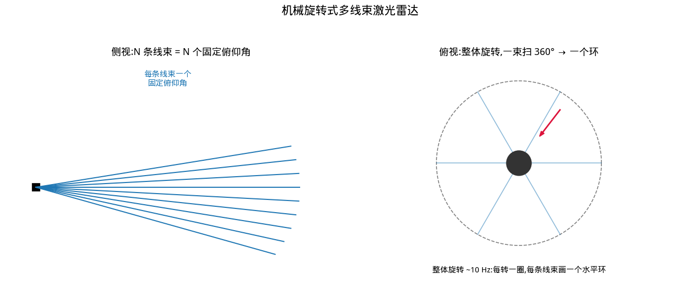
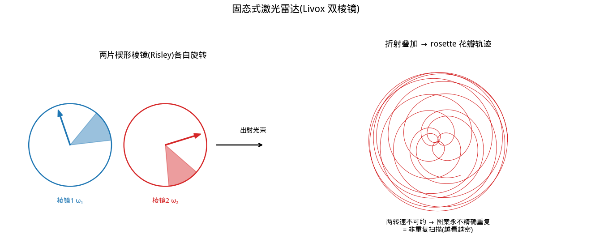
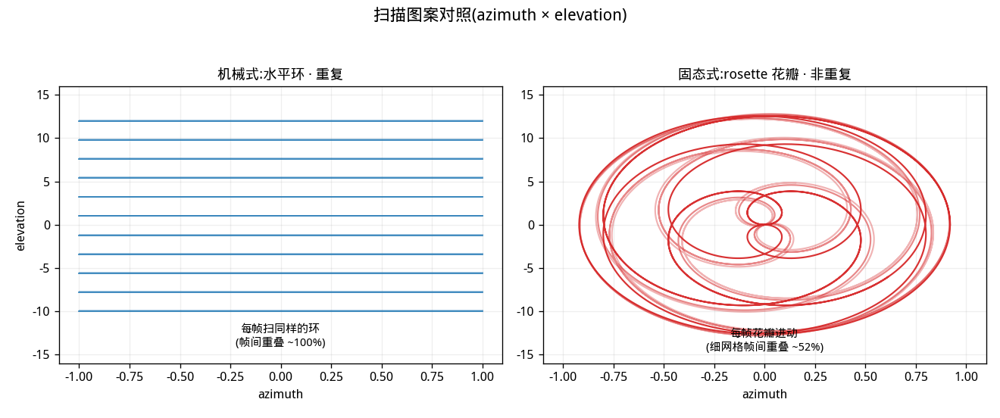
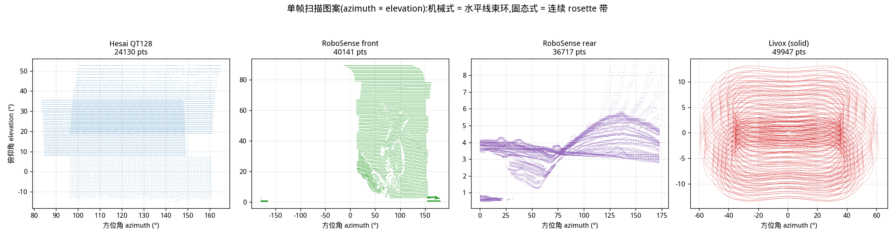
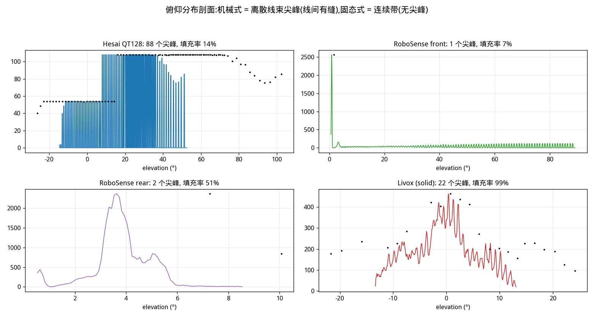
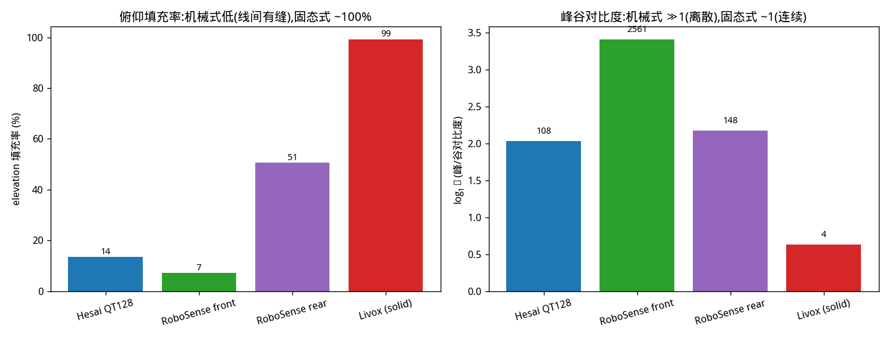
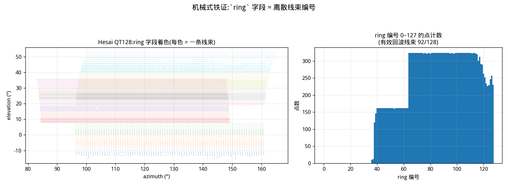
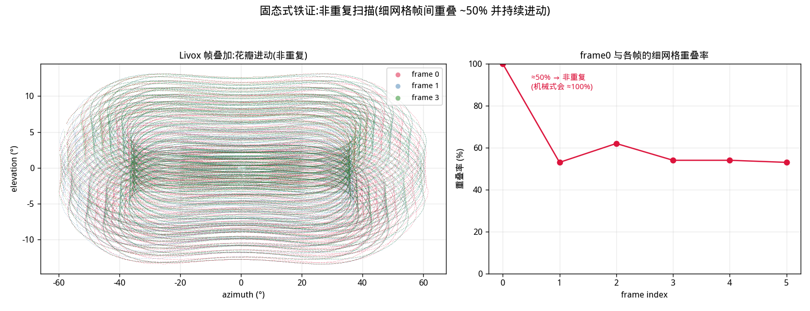

# 激光雷达原理：机械旋转式 vs 固态式（以 Hesai QT128 / RoboSense / Livox 实测印证）

> 本文记录机械旋转式与固态式两类激光雷达的成像原理与区别，并以本仓库一次协同采集（`data/20260728_094028/`）里的三台设备——禾赛 QT128、速腾 RoboSense、图漾 Livox 固态——的点云数据逐项印证。结论：**扫描机构决定点云的空间分布与时间特性**，机械式打"环"、重复，固态式打"花瓣"、非重复。所有数值取自实测 PCD。

<!--more-->

## 关键参数（实测）

| 设备 | 类型 | 扫描机构 | 单帧点数 | 判据 |
|---|---|---|---|---|
| Hesai QT128 | 机械式 | 整体旋转 + 128 线束 | ~41472 | `ring` 字段 0–127（92 线有回波） |
| RoboSense（前/后） | 机械式 | 整体旋转 + 多线束 | ~37600–40600 | 离散线束（对比度 148–2561） |
| Livox | 固态式 | 双 Risley 棱镜 rosette | ~50016 | 连续带（填充率 99%、对比度 4.3） |

---

## 一、共同基础：飞行时间测距 + 逐点扫描

不论机械还是固态，激光雷达都做同一件事：**主动发一束激光、收回波、测时间，得到一个点的距离**，再靠**扫描机构**把这束光扫过视场，逐点拼出点云。

- **测距（ToF）**：$r = c\,\Delta t / 2$。$c$ 为光速，$\Delta t$ 为发收时间差，除 2 是因为光走了一个来回。
- **每点的完整属性**：扫描机构给出光束的指向（方位角 $\theta$、俯仰角 $\phi$），ToF 给距离 $r$，回波强度给 intensity，由此算出三维坐标
  $$x=r\cos\phi\cos\theta,\quad y=r\cos\phi\sin\theta,\quad z=r\sin\phi$$
- **两者的全部区别都在"扫描机构"上**：光束怎么被导向、按什么轨迹扫过视场。这决定了点云长什么样、单帧密不密、帧间重不重复。

---

## 二、机械旋转式

### 2.1 原理

发射/接收模块**整体绕竖轴旋转**（约 10 Hz）。垂直方向上排布 **N 条线束**，每条线束一个**固定俯仰角**。每转一圈，每条线束扫出一个**水平环（ring）**，N 条线束得到 N 个环。



### 2.2 点云指纹

- **扫描图案 = 水平环**：在方位角×俯仰角平面上，点聚成 N 条水平线（每条 = 一个 ring）。
- **重复扫描**：每转一圈打的是**同一组环**，帧与帧几乎完全重叠（细网格重叠率接近 100%）。
- **离散线束**：俯仰方向是 N 个**离散**值，线束之间有缝——俯仰分布呈尖峰，填充率低。
- **有结构**：SDK 通常带 `ring` 字段（线束编号），点云可还原成 N 行的规整结构。

---

## 三、固态式（Livox 双棱镜 / Risley）

### 3.1 原理

没有整体旋转的镜组。两片同轴的**楔形棱镜（Risley 棱镜）**各自以不同转速旋转，每片棱镜像一个"光楔"把光束偏一个固定角度，**两片折射叠加**后，光束指向沿一条**rosette（花瓣）轨迹**运动。因为两个转速**不可约**（比值非有理数），花瓣图案**永不精确重复**——称为**非重复扫描**。



> 术语澄清：Livox 这类"半固态/混合固态"仍有两片**旋转**棱镜（有运动部件），但省去了整体旋转镜组，故体积小、寿命长、车规友好。真正的"全固态"（OPA 相控阵、Flash 面阵）无任何运动部件，原理不同，本文不展开。

### 3.2 点云指纹

- **扫描图案 = rosette 花瓣**：方位×俯仰平面上是连续的曲线带，而非水平环。
- **非重复扫描**：花瓣缓慢**进动**，每帧打不同位置，帧间细网格重叠率只有约 50%。
- **连续带**：俯仰方向被**连续**填满（无离散尖峰），填充率接近 100%。
- **累积换分辨率**：积分时间越长，花瓣填得越密——单帧偏稀，但多帧合并能覆盖到机械式打不到的缝。

---

## 四、扫描图案对照



**一句话**：机械式逐帧"刷同样的环"，固态式逐帧"挪着画花瓣"。

---

## 五、三设备实测印证

以下均取自 `data/20260728_094028/` 各设备首帧（valid: $r>0.3$ m）。

### 5.1 单帧扫描图案（方位 × 俯仰）



- **Hesai QT128 / RoboSense**：点聚成水平条带（环），俯仰离散——机械式特征。
- **Livox**：点连续铺成一个带，看不到独立水平线——固态 rosette 特征。

### 5.2 俯仰分布剖面（离散尖峰 vs 连续带）



把每帧所有点的俯仰角做直方图：

| 设备 | 尖峰数 | 俯仰填充率 | 峰/谷对比度 | 结构 |
|---|---|---|---|---|
| Hesai QT128 | 88 | 14% | 108 | 离散线束 |
| RoboSense front | ~1（场景主导） | 7% | 2561 | 离散 |
| RoboSense rear | ~2 | 51% | 148 | 离散 |
| Livox | 1 个宽峰 | **99%** | **4.3** | 连续带 |



机械式俯仰有缝（填充率低、对比度 ≫1）；Livox 连续填满（填充率 ~100%、对比度 ~1）。这是区分机械式与固态式的关键指标。

### 5.3 `ring` 字段



Hesai QT128 的 PCD 带 `ring` 字段（0–127），每个值对应一条物理线束。本场景中 128 线里约 **92 线**有有效回波（远景/天花板/地板部分线束未命中）。

### 5.4 非重复扫描



把 Livox 的 frame 0/1/3 叠在一起，能看到花瓣**进动**（颜色错开）；frame 0 与后续帧在 0.25° 细网格上的重叠率只有约 **50%**——机械式同样测试会接近 100%。即 Livox 每帧打不同位置、靠累积增密。

---

## 六、综合对比

| 维度 | 机械旋转式 | 固态式（Livox 双棱镜） |
|---|---|---|
| 扫描机构 | 整体旋转镜组 + N 固定线束 | 两片 Risley 棱镜各自旋转 |
| 扫描图案 | 水平环 | rosette 花瓣 |
| 重复性 | 重复（每圈同图案） | 非重复（进动） |
| 分辨率 | 固定（线数 × 方位） | 随积分时间增长 |
| 单帧密度 | 高（近乎整圈） | 较稀（花瓣只盖一部分） |
| 俯仰结构 | 离散尖峰（有缝） | 连续带（无缝） |
| 是否带 ring | 是 | 否 |
| 运动部件 | 整体旋转（有磨损） | 仅两片小棱镜 |
| 体积/寿命/车规 | 较大 | 小、友好 |
| 典型产品 | Hesai / RoboSense / Velodyne | Livox Mid / HAP / AVIA |

---

## 七、选型与实践

- **要单帧就稠密、数据规整（有 ring、易做逐帧感知/运动估计）**：选机械式（QT128、RoboSense）。远距、大场景、需要固定环结构喂给下游算法时占优。
- **要体积小、靠时间累积出高分辨、补盲补缝**：选固态（Livox）。近中距、安装空间紧、可容忍单帧稀疏时占优。
- **数据使用注意**：
  - 机械式 PCD 带 `ring`，可按线束组织；RoboSense 这批未带 ring，但离散线束结构与 Hesai 一致。
  - 固态式（Livox）单帧偏稀，**静态建图务必多帧累积**（进动会填满视场，密度随帧数上升）；逐帧匹配因无固定环结构需用通用配准（ICP/NDT）。
  - 三台在本场景的有效量程都在约 **0.6–5 m**（近景室内），$r$ 中位数 0.7–2.8 m；远距感知宜换长距机械式或 ToF。

---

## 附：复现

图均由 `tools/make_lidar_figures.py` 生成（读 `data/20260728_094028/`，输出 `sensors/lidar/assets/`）：

```bash
python3 tools/make_lidar_figures.py
python3 tools/make_lidar_figures.py --run data/20260728_094028 --out sensors/lidar/assets
```

指纹计算（俯仰填充率、峰谷对比度、`ring` 计数、细网格重叠率）均可在该脚本中找到对应实现。
