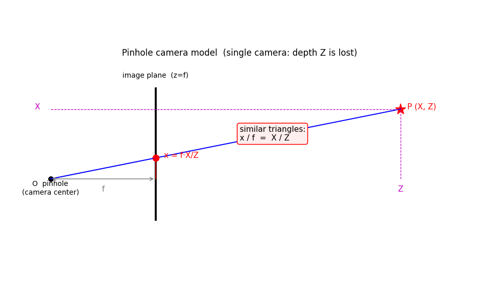
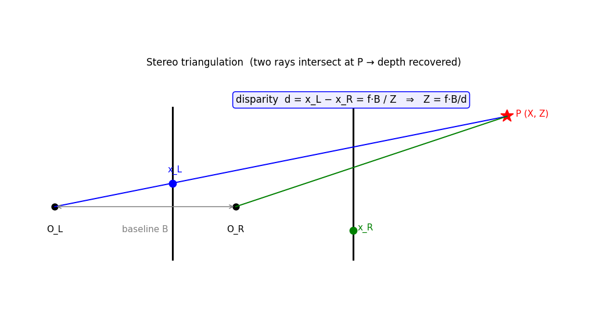
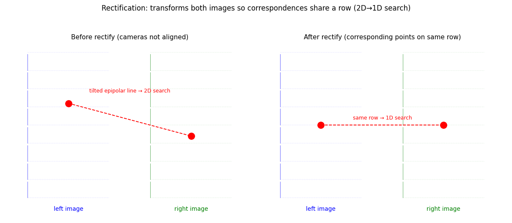
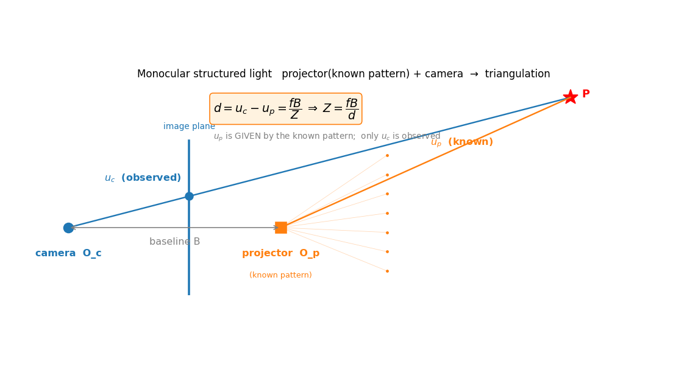
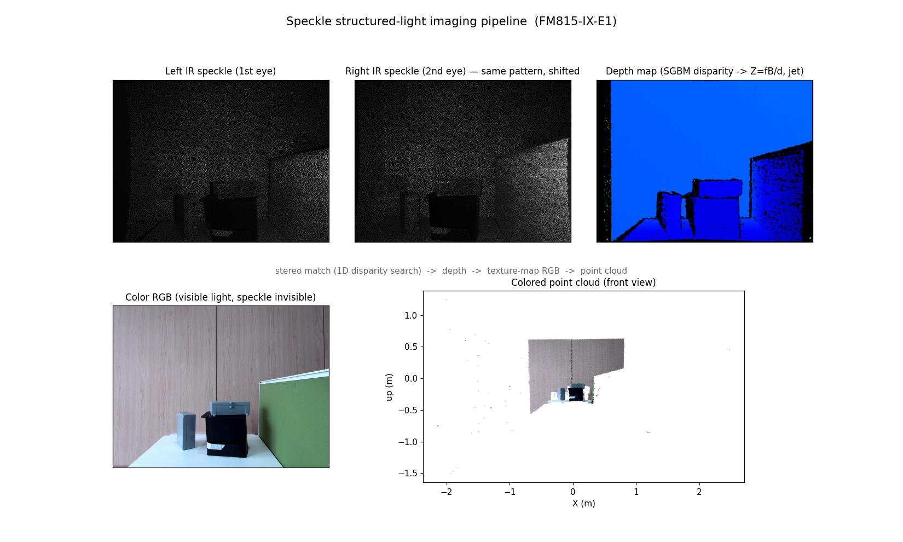
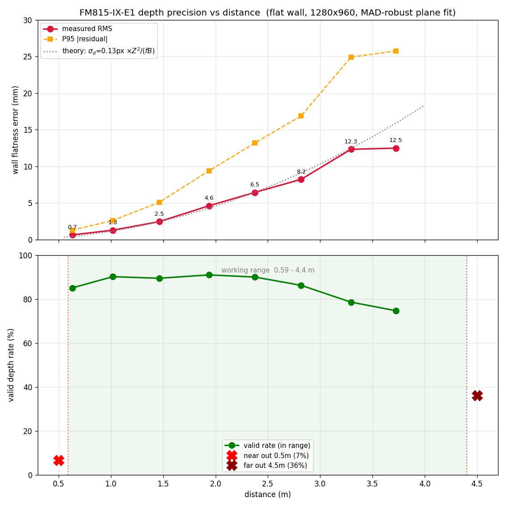
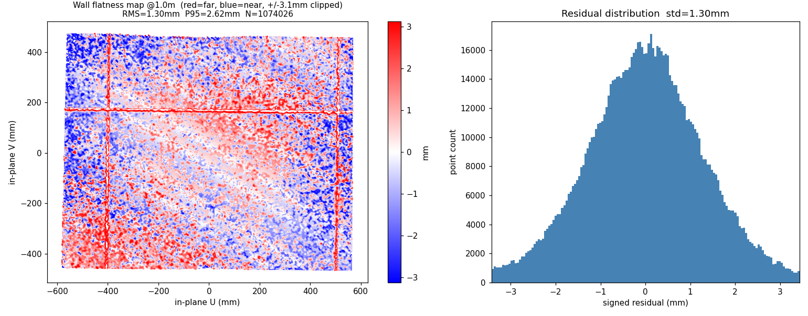
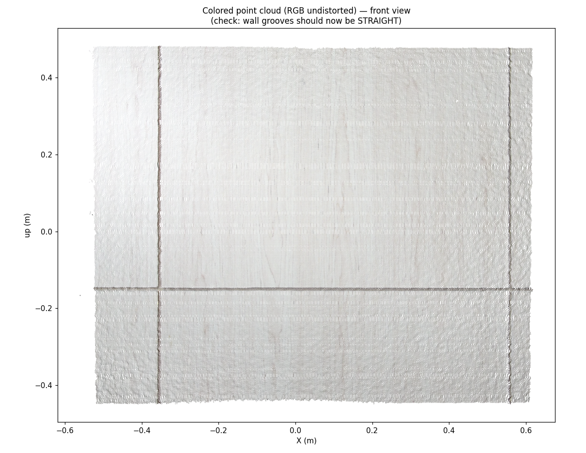
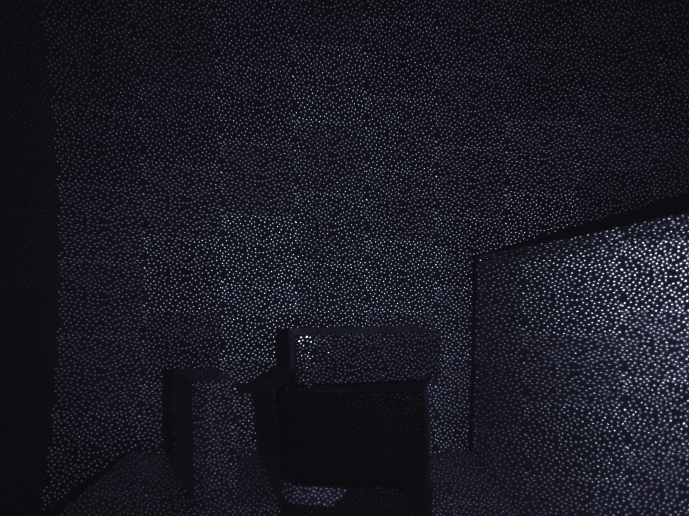

# 结构光理论及 FM815-IX-E1 实例验证

本文先建立结构光与双目立体视觉的一般理论(第一部分),再以仓库内的图漾 FM815-IX-E1 3D 相机(IP `192.168.1.114`)为实例,说明其参数如何代入理论(第二部分),以及实测数据如何与理论预测对应(第三部分);第四部分记录采集、标定与设备特性。结论均附依据与复现方法,数值取自 `DumpAllFeatures` 特性转储、设备出厂标定与仓库内实测采集,配图位于 `assets/`。

---

## 一、结构光与双目立体视觉理论

**符号约定**(贯穿全文):

| 符号 | 含义 | 单位 |
|---|---|---|
| `P = (X, Y, Z)` | 物点的三维坐标 | mm |
| `Z` | 深度,物点沿光轴的距离 | mm |
| `X`, `Y` | 物点的横向、纵向坐标 | mm |
| `f` | 焦距(= 物理焦距 ÷ 像素尺寸) | px |
| `B` | 基线,两光心的横向间距(双目 = 左右相机;单目 = 相机↔投射器) | mm |
| `d` | 视差,同一物点在两图中的水平位置差 | px |
| `x_L, y_L` / `x_R, y_R` | P 在左 / 右相机图像中的坐标 | px |
| `u_c` / `u_p` | (单目)相机像列 / 投射器已知的投射列 | px |
| `σ_d` | 子像素视差噪声 | px |
| `ΔZ` | 每 1 视差像素对应的深度增量 | mm |

**坐标系**:原点在左相机光心(双目)或相机光心(单目);$+Z$ 沿光轴(深度方向),$+X$ 沿基线方向,$+Y$ 纵向;像坐标以主点为原点。**量纲自洽**:
$$
Z=fB/d\;\to\;\text{px·mm/px}=\text{mm}
$$

### 1.1 结构光概述与两种架构

结构光的共同思想是主动投射已知图案、由相机观察求深度。环境光下普通物体表面纹理不可控,结构光通过自带投射器把纹理"打"到场景上,使深度可测。按相机数量分为两种架构。

| | 单目结构光 (monocular) | 双目结构光 / 主动双目 (active stereo) |
|---|---|---|
| 构成 | 1 投射器 + 1 相机 | 1 投射器 + 2 相机(立体对) |
| 测距 | 相机观察投射图案的形变,以「投射器-相机」基线三角测量 | 投射器投 IR 散斑作人工纹理,两相机做立体匹配(视差→深度) |
| 典型 | 初代 Kinect、RealSense F200 | RealSense D4xx、Apple TrueDepth、本设备 |
| 弱点 | 受环境光干扰较大 | 弱纹理/反光/透明面仍难匹配 |

主动双目即「结构光 + 立体匹配」:投射器不直接参与测距,仅提供人工纹理使左右相机得以建立对应关系。本设备属此类。单目结构光亦可行,其深度公式见 §1.7。

### 1.2 针孔成像与深度的丢失

相机成像的基础是针孔模型:把相机简化为一个光心 $O$ 和一个像面,物点 $P$ 发出的光经 $O$ 投到像面上一点 $p$ 成像。建立相机坐标系:$O$ 为原点,$Z$ 轴沿光轴指向场景,$X$ 轴纵向,像面位于 $z=f$ 处,$f$ 为焦距。



如图,物点 $P=(X,Z)$($Z>f$)的光线 $OP$ 与像面 $z=f$ 相交于像点 $p$。**小三角形 $O\text{-}f\text{-}p$ 与大三角形 $O\text{-}Z\text{-}P$ 相似**,对应边成比例,故像点 $p$ 的横向坐标 $x$ 满足:

$$
\frac{x}{f}=\frac{X}{Z}\quad\Longrightarrow\quad x=f\,\frac{X}{Z}\qquad(\text{纵向同理 } y=f\,\tfrac{Y}{Z})
$$
此即针孔投影:3D 点 $(X,Y,Z)$ 投到像点 $\bigl(f\,\tfrac{X}{Z},\; f\,\tfrac{Y}{Z}\bigr)$。投影把三维坐标压成二维 $(x,y)$,$Z$ 在此过程中消失——同一条光线 $OP$ 上远近不同的物点都投到同一个像点 $p$。因此单张图像无法区分「近处的小物」与「远处的大物」,这是单目不能测距的根本原因,也是需要双目(两个观察点)的动机。

### 1.3 双目立体视觉:三角测量与深度公式

两个相机从不同位置观察同一物点,各得到一条指向它的光线,两线交点即物点的 3D 位置——此为三角测量。



设两相机焦距同为 f、光轴平行、光心横向相距基线 B(左光心 O_L 在原点,右光心 O_R 在 (B,0,0),均朝 +Z;此为整流后的标准姿态,见 §1.6)。物点 P=(X,Y,Z)。由 §1.2 的针孔投影:

- P 在左相机的像横坐标 $x_L=f\,\dfrac{X}{Z}$;
- P 在右相机坐标系横坐标为 $X-B$,像横坐标 $x_R=f\,\dfrac{X-B}{Z}$。

两式相减得视差:

$$
d=x_L-x_R=\frac{fX}{Z}-\frac{f(X-B)}{Z}=\frac{fB}{Z}
$$


视差 $d$ 与深度 $Z$ 完全确定,解出:

$$
\boxed{\,Z=\dfrac{f\,B}{d}\,}
$$


$f$、$B$ 为标定常数,$d$ 由两幅图测得,即得深度 $Z$。物点移近($Z$ 减小)则 $d=fB/Z$ 增大,移远则 $d$ 减小,故视差大对应近、小对应远。

**对应问题(立体匹配)**:`Z=fB/d` 的前提是已知同一物点 P 在左右图中的像点 x_L 与 x_R 对应同一物点。但左右图各有上百万像素,哪个左像素对应哪个右像素并非给定,需在两幅图中搜索——此即对应问题,是双目视觉的计算核心。匹配依赖图像纹理:无纹理区域左右图皆均匀,无法判定对应。这正是结构光投射散斑补纹理、用 SGBM 算法求解、并以整流把对应点约束到同一行的动机(§1.6)。

**SGBM(Semi-Global Matching,半全局匹配)** 是求解对应问题的主流算法(Hirschmüller, 2005),介于纯局部与纯全局之间,兼顾速度与鲁棒性:

1. **匹配代价**:对每个像素,在视差窗内逐候选视差算一个小窗口的块相似度(代价),得"像素-视差"代价空间。
2. **代价聚合**(核心):从该像素沿多个方向(通常 5 或 8 条一维路径)累加代价,并对视差跳变施加惩罚($P_1$ 罚小跳、$P_2$ 罚大跳)。这把"好的匹配"沿路径传播过弱纹理区,近似实现全局平滑;因只做多条一维聚合而非真正的二维全局优化,故称"半全局"——比纯局部块匹配鲁棒,比真全局方法(图割、置信传播)快得多。
3. **视差选取**:每个像素取聚合代价最小的视差。
4. **后处理**:亚像素插值(使 $\sigma_d$ 可达 0.1 px)、左右一致性 LRC(剔除遮挡与误匹配)、唯一性(最优与次优代价差距不足则弃)、散斑/中值滤波。

本设备的 `TY_INT_SGBM_*` 参数即对应 SGBM 各环节:`DISPARITY_NUM`/`DISPARITY_OFFSET`(视差窗)、`UNIQUE_FACTOR`(唯一性)、`LRC`/`LRC_DIFF`(左右一致性)、`SEMI_PARAM_P1`/`P2`(平滑惩罚)、`MATCH_WIN_WIDTH/HEIGHT`(匹配窗)、`MEDFILTER`(中值滤波)。

**为什么随机散斑能用于匹配**:SGBM 匹配的不是单个像素,而是以每个像素为中心的**小窗口(如 7×7)**——把左图某窗口与右图各候选窗口逐对比对,取最相似(代价最小)者,其水平位移即视差。随机散斑把大量亮点随机撒在暗背景上,使**每个小窗口内的亮点排布都独一无二**(随机 → 高熵 → 可区分),故左图窗口能在右图找到唯一对应。若用条纹/网格等规则图案,不同位置窗口图案相同,会产生歧义匹配——这正是用「随机」点阵的原因。

**散斑之间的暗点怎么办**:暗点(两亮点之间的像素)本身无亮度变化,但匹配以**窗口**为单位——以暗点为中心的窗口仍含周围若干亮点,故仍有可辨识的局部图案可供匹配。此外 SGBM 的半全局代价聚合($P_1$/$P_2$ 平滑惩罚)会把周围高置信(亮点)的视差**传播**到相邻暗点,中值滤波进一步补全。因此深度是**逐像素稠密**给出的(每像素一个视差),而非仅在亮点处;只有窗口内完全无点的较大空白区才匹配失败、深度无效。要点:亮点与暗点同在一片表面上(如同一面墙),本就具有相同视差,匹配器还原的是这个一致视差,与该像素是亮是暗无关。

**逐像素稠密来自匹配,不是插值**:每个像素的视差由块匹配在整流后的同一行(极线)上、于视差窗内搜索最小代价取 argmin 得到——「块匹配沿极线搜索」是视差的来源,而非从邻居视差插值。两点澄清:① SGBM 的「半全局」代价聚合让每个像素的代价受相邻像素影响(这是弱纹理/暗点能匹配的原因),但最终仍是**逐像素独立的 argmin 决策**,不是把邻居的视差值插值过来;② 插值只用于精化与后处理——亚像素精度是对**已匹配**像素的代价曲线做抛物线插值(把整数视差精化到 0.1 px),中值滤波平滑视差,可选的 inpainter 填补无效区。这些不凭空产生匹配,故「逐像素稠密」的主体是匹配,不是插值。

### 1.4 三维坐标三角化(点云)

Z 已知后,X、Y 由左图像坐标反推(针孔投影的逆):

$$
X=x_L\,\frac{Z}{f},\qquad Y=y_L\,\frac{Z}{f}
$$
每个深度像素 $(x_L,y_L)$ 与其 $Z$ 组合为一个 3D 点 $(X,Y,Z)$,全图遍历即得点云。$Z$ 为轴向深度(沿光轴的垂直距离),即 $d=fB/Z$ 直接给出的量,非斜距;轴向深度只随物体远近变化、与像素位置无关,故平墙的轴向深度近似常数。

### 1.5 深度精度 ΔZ = Z²/(f·B) 与子像素

对 $Z=fB/d$ 求视差 $d$ 的微分,含义为视差每抖动 $dd$ 像素引起的深度误差 $dZ$:

$$
Z=\frac{fB}{d}\;\Longrightarrow\;\frac{dZ}{dd}=-\frac{fB}{d^2},\qquad |dZ|=\frac{fB}{d^2}|dd|=\frac{Z^2}{fB}|dd|
$$
视差每差 1 像素($|dd|=1$),深度差:

$$
\Delta Z=\frac{Z^2}{f\,B}
$$
深度被视差量化,因 $\Delta Z\propto Z^2$,深度精度随距离平方退化——此为双目(及一切三角测距)的几何属性。

实际匹配为子像素(sub-pixel):SGBM 通过块相关度的亚像素插值,视差精度可达 0.1 像素量级。设子像素视差噪声为 $\sigma_d$,则深度噪声 $\mathrm{RMS}\approx\sigma_d\,\dfrac{Z^2}{fB}$。$\sigma_d$ 由匹配算法与纹理质量决定,与距离近似无关,故深度噪声继承 $\Delta Z\propto Z^2$。

### 1.6 整流与视差搜索窗(量程)

**整流(rectification)** —— §1.3 中「两相机平行、$Z$ 同向、$X/Y$ 同向」并非物理保证。实际两 IR 相机装配时存在微小旋转(相对姿态 $R$,非单位阵)与横向位移(基线 $\mathbf{t}$,即 $B$),并不严格平行同行。出厂立体标定测出这对相对姿态(本设备即「右→左 IR 外参」:$t_x=-99.89$ mm 为基线,另含旋转分量 $R$),据此为左右图各算一个单应变换(homography),把两幅图重采样到统一的**规范化姿态**:两光轴平行、像面共面、基线水平、对应点落在同一行(epipolar 约束)、行列方向同向。

即:**平行与坐标轴同向不是靠物理装配保证,而是靠标定出的相对姿态,用单应变换把两个相机「虚拟摆正」得到的**。这组变换同时校正了镜头畸变(故点云几何干净,仅 RGB 因独立镜头带畸变)。整流后的图像上 §1.3 推导成立,SGBM 只需沿同一行做一维搜索。



**视差搜索窗** $[d_{\min},\,d_{\max}]$ 是什么、怎么得来:它是 SGBM 的一个**配置参数**,而非物理常量。匹配器只在此范围内的候选视差里搜索,超出即判为无匹配、深度无效。该窗由两个量决定:起始视差 $d_{\min}$(SDK `DISPARITY_OFFSET`)与视差个数 $N$(SDK `DISPARITY_NUM`),$d_{\max}=d_{\min}+N$;制造商按设备的预期工作距离选定该窗,使其经 $Z=fB/d$ 换算后覆盖目标量程(本设备 $d_{\min}=25$、$N=162$ → $[25,187]$ → 0.59–4.4 m,见 §2.3)。之所以是有限窗而非 0 到无穷:① 计算量随视差范围线性增长,须裁剪以保实时;② 视差过小(远距)则基线相对距离过短、三角测量失效;③ 视差过大(近距)则匹配窗越过图像边界、左右立体重叠不足。该窗经 $Z=fB/d$ 换算即工作量程:

$$
Z_{\min}=\frac{fB}{d_{\max}}\;(\text{近端}),\qquad Z_{\max}=\frac{fB}{d_{\min}}\;(\text{远端})
$$


即**工作量程 = 视差搜索窗经 $Z=fB/d$ 换算**。量程应以视差窗与几何推导为准,而非从数据有效值上下界反推(后者为循环论证)。

### 1.7 单目结构光(对照)

单目结构光理论上可行,且为成熟技术(初代 Kinect、RealSense F200、工业条纹扫描仪)。其测距为:1 投射器 + 1 相机;投射器投一幅已知图案,相机观察其被 3D 表面调制后的形态。因图案已知,系统将投射器视为第二只「虚拟眼」,在「投射器↔相机」间做三角测量。



与双目的差别:双目是两台相机各自观察、在两幅图里**搜索**对应;单目中投射器图案**已知**,$u_p$ 给定,只有相机的 $u_c$ 需观察,视差 $d=u_c-u_p$。几何上仍为 $Z=fB/d$。

**深度公式推导**(单目几何上等价于「双目中以图案已知的投射器替换一只相机」)。设投射器与相机光轴平行、相距基线 B,焦距同为 f,相机中心在原点,投射器中心在 (B,0,0)。对物点 P=(X,Y,Z):

- 相机观察到的像列 $u_c=f\,\dfrac{X}{Z}$;
- P 在投射器坐标系横坐标为 $X-B$,其已知的投射列 $u_p=f\,\dfrac{X-B}{Z}$。

两者之差 $d=u_c-u_p=\dfrac{fB}{Z}$,即 $Z=\dfrac{fB}{d}$,与双目同形。差异仅在于视差 $d$ 的获取:

| | 视差来源 | 对应关系的建立 |
|---|---|---|
| 双目 | `d = u_c − u_另一相机像素` | 在两幅相机图中搜索(SGBM 块匹配) |
| 单目 | `d = u_c − u_p`(u_p 已知) | 不搜索两图,但需先识别相机图中该点对应投射图案的哪一点 → 得到 u_p |

u_p 已知化的三种主流方案:

1. **空间编码图案**:每个投射像素的图案唯一(De Bruijn 序列、Gray 码条纹等),单次拍摄即可解码出身份。
2. **相移条纹**:投多幅相移正弦条纹逐像素求相位,近场精度可达微米级(多次拍摄)。
3. **固定散斑 + 参考图**(Kinect v1 的 light-coding):投固定随机散斑,先存一幅已知距离的参考散斑图,运行时将观测散斑与参考散斑块匹配(以参考图充当第二幅图)。

单目与双目的主要差异:

| | 单目结构光 | 双目结构光(本设备) |
|---|---|---|
| 三角测量对象 | 投射器 ↔ 相机 | 左相机 ↔ 右相机 |
| 投射图案要求 | 已知 / 编码(每特征具唯一身份) | 随机散斑即可(仅作纹理) |
| 投射器是否需标定 | 是(作虚拟相机,标定较难) | 否(仅作照明) |
| 典型产品 | Kinect v1、RealSense F200、工业条纹扫描仪 | RealSense D4xx、本设备、TrueDepth |

精度仍为 $\Delta Z=Z^2/(fB)$——三角几何不区分「相机↔相机」与「相机↔投射器」。现代消费级深度相机多采用主动双目,因一片廉价的随机散斑投射器(无需编码、无需标定)配两台相机即可,制造简单、对投射器漂移较鲁棒;本设备选用双目属工程取舍,并非单目不可行。

---

## 二、本设备实例:FM815-IX-E1

### 2.1 设备架构与参数

`DumpAllFeatures -ip 192.168.1.114` 实测型号 **FM815-IX-E1**,接口代际 **Gige_2_0**(HW 1.3.0,FW 3.13.70),5 个组件:

| SDK 组件 (ID) | 角色 | 实测参数 |
|---|---|---|
| `TY_COMPONENT_LASER` (0x400000) | IR 散斑投射器(仅控制,不出图) | power=100,auto_ctrl=1,可读写 |
| `TY_COMPONENT_IR_CAM_LEFT` (0x40000) | 左 IR 相机 | 1280×960 mono8,fx=1102.09,exposure≤990,gain∈[0,255] |
| `TY_COMPONENT_IR_CAM_RIGHT` (0x80000) | 右 IR 相机 | 1280×960 mono8,fx=1104.60;右→左外参 tx=−99.89 mm(基线) |
| `TY_COMPONENT_DEPTH_CAM` (0x10000) | SGBM 深度输出(计算量) | 320×240 / 640×480 / 1280×960 |
| `TY_COMPONENT_RGB_CAM` (0x100000) | RGB 相机(仅上色) | 2560×1920 |

判定为主动双目的依据:存在左右两个 IR 相机,右相机带 `TY_STRUCT_EXTRINSIC_TO_DEPTH`(rightIR to leftIR extrinsic),平移分量 tx=−99.89 mm 即基线;深度组件下挂完整的 `TY_INT_SGBM_*` 参数(`DISPARITY_NUM`、`UNIQUE_FACTOR`、`LRC`、`MEDFILTER` 等),SGBM 为立体匹配算法。RGB 与测距无关,仅经 `TYMapRGBImageToDepthCoordinate` 给点云上色。接口 Gige_2_0:`LASER` 的 `TY_INT_LASER_POWER`/`TY_BOOL_LASER_AUTO_CTRL` 均 access=3(可读写),走旧 `TYSetInt/TYSetBool`,SDK 对 LASER/IR 的设置均有效。

### 2.2 散斑投射与成像流水线

投射器内置衍射光学元件(DOE),把红外激光打散为大量随机分布的 IR 亮点(散斑),静态固定图案,对人眼与 RGB 不可见,左右 IR 相机可清晰成像。深度测量的核心是测定同一 3D 点在左右 IR 图中的水平位置差(视差),经 `Z=fB/d` 换算为深度;RGB 另拍一张可见光贴到深度点得上色点云。



上图中左右 IR 散斑为同一片点阵(水平错开,即立体匹配的输入),经 SGBM 得深度图,再以 RGB 上色为点云。RGB 面板看不到散斑(红外不可见),而深度与点云的获得均依赖它。

### 2.3 设备参数套入理论

把本设备的实测参数代入第一部分的理论公式,得到可验证的预测:

- 焦距 $f=1102.09$ px,基线 $B=99.89$ mm,$fB\approx 110\,080\,\text{px·mm}$(单位是 px·mm :用于 $Z=fB/d$ 时其 px 与视差 $d$ 的 px 相消,结果为 mm)。
- 视场 $\text{HFOV}=2\arctan(640/1102.09)=60.2°$、$\text{VFOV}=2\arctan(480/1102.23)=47.1°$;点云呈以相机为顶点的扇形径向展开即此视场锥的几何表现。
- 视差示例(§1.3 的 $d=fB/Z$):1 m 处 $d\approx110$ px,0.6 m 处 $d\approx187$,4 m 处 $d\approx27$。
- 量程预测(§1.6):实测视差窗 `DISPARITY_OFFSET=25`、`DISPARITY_NUM=162`,即 $d\in[25,187]$;$Z_{\min}=110080/187\approx589\,\text{mm}\approx0.59\,\text{m}$,$Z_{\max}=110080/25\approx4403\,\text{mm}\approx4.41\,\text{m}$。

![视差-距离曲线与搜索窗:窗 [25,187] px 对应量程 0.59–4.4 m](assets/disparity_range.png)

- 精度预测(§1.5 的 ΔZ=Z²/(fB)):0.6 m→3.3 mm/视差像素,1 m→9.1,2 m→36,3 m→82;子像素 σ_d 待实测反推(§3.2)。

第三部分将逐项检验这些预测与实测的吻合度。

---

## 三、理论与实测的对应

### 3.1 工作量程:预测 0.59–4.4 m vs 越界实测

理论预测量程 0.59–4.4 m(§2.3)。实测深度有效值落在 558–4164 mm,处于理论区间内(极端视差处匹配稀疏,略收缩)。将相机正对平墙、由 0.5 m 移至 4.5 m,记录深度有效率(`depth>0` 像素占比):

| 距离 | 有效率 | 现象 |
|---|---|---|
| 0.5 m | 6.7% | 墙体 0.5 m < 近端 0.59 m,整面墙深度无效,残存 6.7% 为墙后背景 |
| 0.6–3.7 m | 75–91% | 量程内,墙体完整可测 |
| 4.5 m | 36.2% | 墙体 4.5 m > 远端 4.4 m,墙体无效,残存 36% 为近处地板/天花板/侧墙 |

两端越界时墙体本身在深度图中消失,与 §1.6 推得的 0.59 m/4.4 m 边界吻合——理论量程被实测印证。量程调整途径:软件改 `DISPARITY_OFFSET/NUM`(视固件);硬件量程 ∝ f·B,本设备固定。

### 3.2 距离-精度:ΔZ=Z²/(fB) vs 9 点实测曲线

正对平墙,在不同距离各采 3 帧(1280×960),以点云到拟合平面的残差衡量平整度。方法关键在只统计墙体上的点:远距时视场溢出墙体,地板/天花板等非墙点会污染结果(曾因此将 2.5 m 的 RMS 误算为 94 mm)。先由深度直方图定墙的尖峰(轴向深度众数),取 ±120 mm 窗剔远处背景;再对窗内点以 MAD(中位绝对偏差)鲁棒迭代拟合主平面并校验正对($|\mathbf{n}\cdot\hat z|>0.9$);取 3×MAD 内点为真墙点,重拟合后算 RMS/P95。各距离结果存于 `data/fm815_precision/d{0.5..4.5}m/flatness.txt`。

| 距离 | RMS (mm) | P95 (mm) | 墙占比 | 有效率 | σ_d (px) |
|---|---|---|---|---|---|
| 0.5 m | — | — | — | 6.7% | 近端越界 |
| 0.63 m | 0.655 | 1.30 | 97.7% | 85.1% | 0.181 |
| 1.02 m | 1.300 | 2.62 | 96.9% | 90.2% | 0.138 |
| 1.46 m | 2.463 | 5.09 | 93.3% | 89.5% | 0.127 |
| 1.94 m | 4.631 | 9.40 | 83.4% | 91.0% | 0.136 |
| 2.38 m | 6.450 | 13.19 | 75.2% | 90.0% | 0.126 |
| 2.82 m | 8.234 | 16.88 | 70.6% | 86.3% | 0.114 |
| 3.29 m | 12.336 | 24.91 | 69.4% | 78.6% | 0.125 |
| 3.72 m | 12.498 | 25.76 | 61.8% | 74.7% | 0.099 |
| 4.5 m | — | — | — | 36.2% | 远端越界 |





**理论印证**:由 §1.5,$\mathrm{RMS}=\sigma_d\,Z^2/(fB)$。以实测 RMS 反推 $\sigma_d$(上表末列):1–3.3 m 段 $\sigma_d=0.114$–$0.138$ px,中位 0.126 px,近似恒定。单次立体匹配的视差抖动稳定在约 0.13 像素、与距离无关,深度噪声完全继承 $\Delta Z\propto Z^2$。图中虚线为理论曲线 $0.126\,Z^2/(fB)$,与实测点吻合——精度随距离平方退化可由 $f$、$B$、$\sigma_d$ 推导并被数据印证。

近端 0.63 m 处 $\sigma_d=0.181$ 偏高(传感器读噪声等贡献约 0.47 mm 近端地板);远端 3.3–3.7 m 处 $\sigma_d$ 降至 0.099、RMS 趋于平台(12.3→12.5 mm):近远端极限时较差匹配率先变无效被剔,存活匹配质量较好,RMS 不再增长但有效率下滑(90%→78%→75%)。综合近端地板与视差量化,得完整精度模型:

$$\mathrm{RMS}(Z)\approx\sqrt{\left(\sigma_d\,\frac{Z^2}{fB}\right)^{\!2}+z_{\mathrm{floor}}^{\,2}},\qquad \sigma_d\approx 0.126\,\text{px},\;\; z_{\mathrm{floor}}\approx 0.47\,\text{mm}$$

近距由 $z_{\mathrm{floor}}$ 主导,中远距由 $Z^2$ 项主导。多帧时间稳定性(同一摆位连采):逐像素深度时间抖动约 0.5 mm,相邻帧残差相关 ≈1.0,表明单帧 RMS 的主体为固定系统性图案(视差量化网格 + 整流残余),时间随机成分仅约 0.5 mm,多帧平均对精度改善有限。

**距离选型**:0.6–1 m 为 0.7–1.3 mm(亚毫米至毫米级);1–2 m 为 1.3–4.6 mm(兼顾精度与覆盖,有效率 >90%);2–3 m 为 4.6–12 mm(厘米级);>3 m 约 12 mm 且有效率下降,不建议。按所需精度倒推安装距离(精度 ∝ Z²)。

### 3.3 散斑必要性:对应问题 vs 投射器开关

§1.3 指出散斑是对应问题所需的人工纹理来源。对照实验(同摆位,640×480,各 3 帧平均):

| LASER 配置 | 深度有效率 |
|---|---|
| power=100,auto=1(出厂频闪) | 33.4% |
| power=100,auto=0(手动常亮) | 33.2% |
| power=0(关闭) | 2.4% |

关闭投射器后深度由 33% 降至 2%,印证散斑是匹配纹理的主要来源、对应问题在无纹理时无解。

`LASER_POWER` 持久化存储,实验后须以 `-laser 100 -lauto 1` 恢复(否则下次裸采集沿用残留 power=0 致深度归零)。`main.cpp` 启动打印 `LASER now: power=X auto=Y` 供核查。

### 3.4 点云密度(稀疏)的来源

深度有效率不高有五个来源,按可调性排列:

- **场景与量程**(影响最大):前景 <0.59 m 的区域整块无效(§1.6)。平放桌面时有效率 6.8%,摆位使目标落入 0.6–4 m 后升至 33%(640×480)或更高(1280×960)。
- **分辨率模式**:默认 640×480 为 1280×960 的降采样(佐证:640 模式 fx=522.43 恰为 1280 的 fx 之半),改用 1280×960 点数 ×4、精度不降。
- **SGBM 严苛度**:默认 `UNIQUE_FACTOR=80` + `LRC=on` 偏精度;放宽至 uniq=20、关 LRC 则有效率 33%→47%,但精度下降。
- **IR 增益**:出厂默认 gain=32 最优;扫描 32/64/128/200 → 33.5%/25.8%/1.3%/0%,调高反而变差。
- **表面材质**(无法消除):玻璃、屏幕、黑色、强反光面打不回 IR 散斑,恒无效。

---

## 四、采集、标定与设备特性

### 4.1 采集配置

批量采集命令:

```
SimpleView_CaptureDump -ip 192.168.1.114 -n 6 -dmode 1280 -outdir <dir>
```

要点:

- depth 用 1280×960(原生分辨率,点数较 640 多 4 倍);
- SGBM 保留默认,仅在明确需要密度时用 `-uniq 20 -nolrc`;
- gain 保持 32(改动后须重置);
- 摆位使目标落入 0.6–4 m,避开屏幕/玻璃/强反光面;
- 按精度选距(§3.2),毫米级安装于 1–2 m。

`main.cpp` 诊断/调参开关:`-dmode`(深度模式)、`-ire/-irg`(IR 曝光·增益)、`-uniq/-nolrc`(SGBM 严苛度)、`-ir`(同开 IR,见 §4.3)、`-laser/-lauto`(投射器功率/频闪)、`-nodepth`(纯 IR)、`-irflash`(本设备无效);每帧统计深度有效率。

### 4.2 标定与 RGB 镜头畸变

设备出厂标定存于各组件 `TY_STRUCT_CAM_CALIB_DATA`,`access=1`(只读),API 不能写回设备;重新标定只能于主机端读出后以自有标定覆盖重算,SDK 内置函数仍用原标定。

| 标定项 | 影响 | 能否自标 | 方法 |
|---|---|---|---|
| RGB 内参 + 畸变 | 彩色上色/对齐 | 能,较易 | 棋盘格/Charuco + OpenCV `calibrateCamera`,主机端覆盖 `color_calib` |
| IR 内参 + 畸变 | 深度几何 | 能,较繁 | 关投射器 + 外部 IR 补光(本设备无 IR 泛光灯,需自备)照棋盘格 |
| 双目外参(基线/整流) | 深度量程精度(关键) | 实际不能 | 出厂锁死;SDK 设备端做 SGBM,无法注入。覆盖需自拍左右 IR、自整流、自立体匹配,等同重写深度引擎 |
| depth↔RGB 外参 | 彩色贴图对齐 | 能 | SDK 自带 `SimpleView_Registration` / `SimpleView_PixelsRegistration` |

**RGB 镜头畸变**:带色点云中墙上直线(凹槽)呈弯曲,且弯曲与彩色图一致。诊断:在 CloudCompare 关闭点云 RGB、改按高度上色后凹槽即变直——几何无畸变,弯曲来自颜色。几何干净的原因:双目深度在整流后的图上计算,IR 镜头畸变已消除,`depth` 存轴向 z(实测 `|depth−点云.z|=0.00 mm`),点云为干净针孔;颜色弯曲的原因:RGB 为独立镜头带桶形畸变,解码 BGR 携带之,贴到干净几何上,凹槽(以颜色才可见)随之弯曲。判别方法:点到平面平整度(离面 z 残差)与针孔拟合残差(点云由该式生成,反拟合残差必为 0)均看不出平面内桶形畸变,须以直线特征判定。

RGB 畸变系数(读出厂标定 `TYGetStruct(...TY_STRUCT_CAM_CALIB_DATA...)`):`intrinsic` fx=1864.8、fy=1865.3、cx=1278.9、cy=955.2;`distortion` 为 Percipio 自定义 12 系数模型(非 OpenCV 的 5/8 系数),前 6 项 `-0.2334, 0.4031, -0.0002, 0.0004, 0.2073, 0.0268`(k1=−0.2334 即桶形)。去畸变用 SDK 的 `TYUndistortImage`(Percipio 12 系数模型,`cv::undistort` 不匹配):解码 BGR 后去畸变(NULL 新内参保持原 fx/fy/cx/cy 输出 pinhole),贴点云时 `color_calib` 畸变清零避免二次校正;在存 JPG 前完成,故 `color_*.jpg` 一并去畸变。



深度标定准确性:1 m 平整度 1.4 mm、量程吻合 `fB/d`、`depth=轴向z`,均表明深度标定准确;唯一问题为 RGB 畸变(属 RGB 相机)。判定标定问题前宜先以已知尺寸核验(误差应 <1%)。应重标的情形:量测明显偏差(深度量程问题,双目外参不可自标,返厂或 Viewer 重标)、彩色整片对不齐(标 RGB)、相机受磕碰(标定漂移)。

### 4.3 投射器与 IR 成像特性

**depth+IR 同开时 IR 帧全黑**:`-ir`(同时开 depth 与左右 IR)存出的 `ir_left/right_*.png` 长期 max≈14/255,gain 0→255 无响应。此非故障,而由光照路由所致:投射器光照仅路由至主流量,depth 与 IR 同开时激光频闪绑定至 depth 时序,深度引擎在亮帧时刻内部取走 IR 图用于匹配,旁路 IR 组件在另一时刻取图、取到灭灯相位,故全黑。

| 模式 | 投射器 | IR 帧 mean / max / std |
|---|---|---|
| depth + IR 同开(`-ir`) | 开 | 7 / 14 / 5(黑) |
| depth + IR 同开(`-ir`) | 关 | 7 / 14 / 5(黑) |
| IR-only(`-nodepth`) | 开 | 199 / 255 / 78(亮) |
| IR-only(`-nodepth`) | 关 | 19 / 50 / 2(黑) |

IR-only 且投射器开时 IR 帧全亮,Laplacian 纹理方差 646(暗帧 105,约 6 倍),可见高密度随机点散斑。本设备无独立 IR 泛光灯(`TY_BOOL_IR_FLASHLIGHT` 于各组件 `TYHasFeature=false`)。采真散斑:`SimpleView_CaptureDump -nodepth -color=off -laser 100 -ire 80`。



### 4.4 复现与佐证

| 结论 | 依据 | 复现 |
|---|---|---|
| 设备为主动双目 SGBM | LEFT/RIGHT IR + SGBM_* + 基线外参 | `DumpAllFeatures -ip .114` |
| 接口 Gige_2_0,旧 API 有效 | LASER_POWER/AUTO_CTRL access=3 | 同上 LASER 段 |
| 基线 B=99.89 mm | 右→左 IR 外参 tx | 同上 `TY_STRUCT_EXTRINSIC_TO_DEPTH` |
| 焦距 fx=1102(1280) | 左 IR 内参 | 同上 `IR_CAM_LEFT` 段 |
| 视场 FOV 60.2°×47.1° | 2·atan(W/(2f)) | §2.3 |
| 工作量程 0.59–4.4 m | fB/d 推导,对齐有效值 558–4164 mm 及越界实测 | §3.1 |
| 精度 ∝ Z²,σ_d≈0.13 px | 9 点曲线反推 | `data/fm815_precision/`、`assets/precision_results.csv` |
| 多帧时间稳定性 | 时间抖动约 0.5 mm,帧间残差相关 ≈1.0 | §3.2 |
| 近/远端边界 | 0.5 m→6.7%、4.5 m→36% 有效率 | §3.1 |
| 散斑为深度纹理来源 | LASER_POWER 0→2.4%、100→33% | `-laser 0` vs `-laser 100` |
| IR 全黑由 co-enable 抢光照 | depth+IR 时 IR max=14;IR-only 时 mean=199 | `-ir` vs `-nodepth -laser 100 -ire 80` |
| RGB 畸变致点云直线弯曲 | 关 RGB 颜色后凹槽变直;depth=轴向 z | CloudCompare 关色 + §4.2 |
| 1280×960 点数为 640 的 4 倍 | 密度对比 | `-dmode 1280` 对比默认 |

---

## 附录:与 LiDAR 的定位差异

LiDAR(禾赛/速腾/Livox)以飞行时间(ToF,直接测光往返)测距,每点独立、稀疏但远(百米级)。结构光以双目立体匹配(投射器仅补纹理)获得稠密深度图(每像素一个深度),受基线限制量程短(米级)、受表面反射率影响大。二者互补:LiDAR 远而稀,结构光近而密。本仓库 7 路设备中,此结构光负责近场稠密 3D,远距离大范围感知由 LiDAR 承担。
